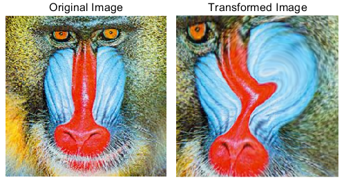
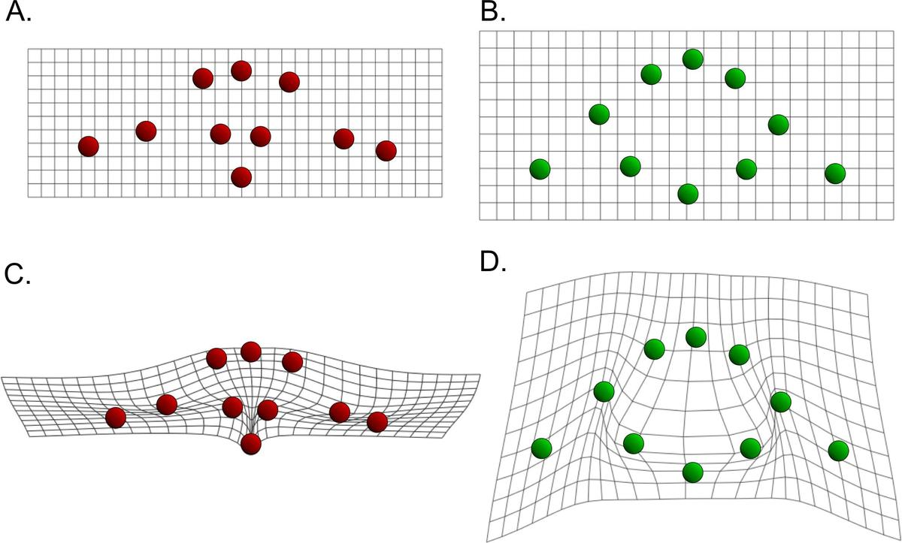
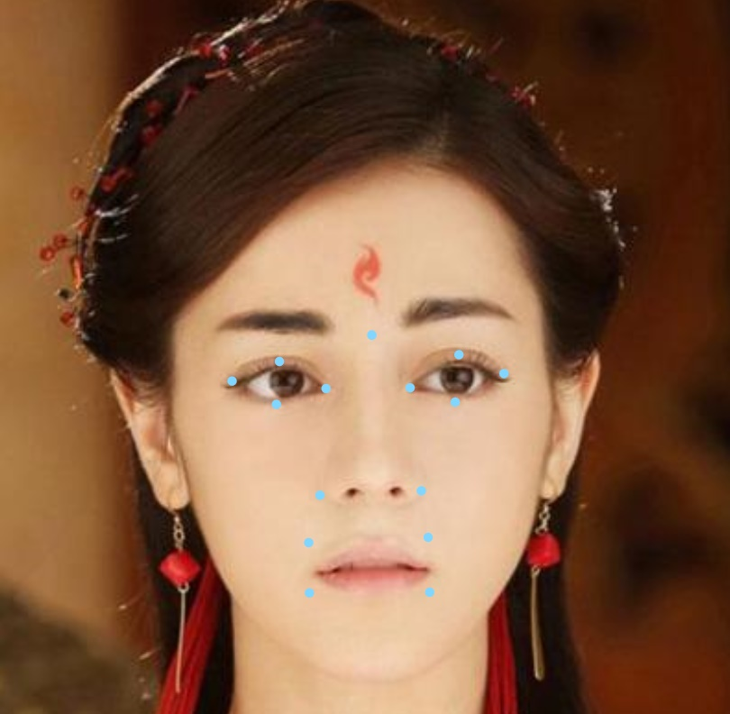
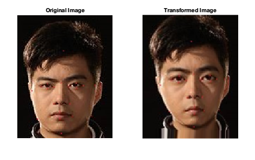

# 数据可视化 图像变换
钟诚 16307110259	周璐鹿 15307110349	张奕朗 16307130242

[TOC]

本项目实现了两种图变换方法：局部仿射变换和薄板样条插值变换。同时运用反向图变换实现了这两种变换方法，并将其运用到了人脸图像处理上。通过对控制点位置的调整，实现了将一个人的外貌变得像另一个人的效果。


## 反向图变换

反向图变换，顾名思义即为两张图对应区域之间的变换，本质是将像素点的坐标通过某一种函数关系，映射到另外的位置。通过定义变换区域和仿射矩阵，便可以实现从原始区域到目标区域的仿射。
图像变换的步骤如下：

1. 确定两张图片中待变换区域于控制点的坐标；
2. 通过两张图片相对应控制点，计算仿射变换矩阵；
3. 通过仿射变换矩阵，将原图像的点对应到相应的目标图像相应位置上，通过插值方法得到该点的三通道值；
4. 输出仿射变换后的图像。

### 变换区域与仿射矩阵的求取
为简化计算，本例中我们均使用几何形状对需要变换的区域进行拟合。

对于每一个区域内对应的控制点 $\text{Origin} = (x_{\text{origin,i}},  y_{\text{origin,i}}),~\text{Map} = (x_{\text{map,i}} , y_{\text{map,i}}),i = 1,\dots,n$,  我们将其中心化并补全为形如

$$
\left[\begin{matrix}
   x_{type,1} & x_{type,2} & x_{type,3} ......  x_{type,n} \\
   y_{type,1} & y_{type,2} & y_{type,3} ...... y_{type,n}\\
   1 & 1 & 1  \\
\end{matrix}\right]
$$
其中$\text{type} = \{\text{Origin}, \text{Map}\}$

 的矩阵后, 对仿射矩阵的求取相当于求一个$3\times 3$ 的矩阵$A$, 使得$A = \arg\min_{A} \Vert \text{Map} - A * \text{Origin} \Vert_2$ 

因为$\text{Map}$矩阵 和$\text{Origin}$矩阵实验中往往是不满秩的，在实际操作中，我们选取$A = \text{Origin} * \text{Map}^\dagger$, 其中$\text{Map}^\dagger$为$\text{Map}$矩阵的伪逆。

在得到变换区域和仿射变换矩阵后，便可以通过局部仿射变换完成反向图变换。


## 局部仿射变换

### 基本原理

在局部仿射变换中，指定局部区域内的坐标点采用对应的仿射变换，而指定变换区域外的坐标点则是采用各仿射变换的加权：
$$
T(X)=
\begin{cases}
	&G_i(X)		&, X\in U_i \\
	&\sum_k w_k(X)G_k(X)	&, X\notin \cup_kU_k
\end{cases}
$$
其中，$w_i(X)=\frac{d_i(X)^{-e}}{\sum_k d_k(X)^{-e}},~e\in[1,2]$为坐标点$X$对应的加权系数，$d_i(X)$为$X$与$U_i$之间的距离，其定义将在下方进行讨论。


### 距离的定义与计算

为了使得图像的仿射变换区域（即$G_i(X)$对应的区域）与加权仿射变换的区域（即$\sum_{i=1}^n w_i(X)G_i(X)$对应的区域）在变换后不出现割裂的现象，（在连续情况下）必须满足以下限制：

对于加权仿射变换区域内任意一点$X_0$，当$X_0$接近某个区域$U_i$时，需要有$\frac{w_i(X_0)}{w_j(X_0)} \rightarrow +\infty,~ j\ne i$；即$d_i(X_0) \rightarrow 0,~d_j(X_0) \ne 0$，可知$d_i(X_0)$应当定义为$X_0$到区域$U_i$的最短距离
$$
d_i(X_0):=\min \Vert X_0 - X_i \Vert_2,~X_0 \notin \cup_k U_k,~X_i \in U_i
$$
下面我们考虑离散的情况：

由于数字化图像的坐标均为整数，所以若继续使用以上定义，则会导致$d_i(X)$的最小值为1，无法满足限制条件$\frac{w_i(X_0)}{w_j(X_0)} \rightarrow +\infty,~ j\ne i$。于是，我们需要对距离的定义进行调整：
$$
d_i(X_0):=\min \Vert X_0 - X_i \Vert_2 - 1 + \epsilon,~X_0 \notin \cup_k U_k,~X_i \in U_i
$$
其中，极小量$\epsilon$由计算机计算$d_i$时所用的数值精度决定，用于防止除0数值溢出导致的错误。


### 区域边缘点检测

#### 区域的边缘点检测算法

若直接计算$X_0$到每个区域$U_i$的最短距离，需要计算仿射区域外（加权仿射区域）每个点到仿射区域内每个点的距离，对于一幅$m\times n$的图像，最坏情况下复杂度会达到$O(m^2n^2)$。虽然距离的计算可以使用$\ell$-$1$范数（曼哈顿距离）来代替$\ell$-$2$范数（欧几里得距离），不过只会引起复杂度在常数上的改变。

为解决这个问题，我们组采用了一个简单而又有效的方法：由于距离$X_0$最近的点一定在仿射变换区域的边缘处，所以我们只需要寻找每个仿射变换区域的边缘点，之后计算$X_0$到每个区域边缘点的距离再取最小值即可。这样可以显著降低计算的时间复杂度。

由于MATLAB中矩阵按照维度顺序进行储存（具体来说，二维矩阵按列储存），我们可以将按储存顺序生成的区域坐标进行纵坐标一阶差分，一阶差分不为0的位置为旧的一列到新的一列的过渡位置，即边缘点的位置；再考虑上第一列和最后一列中可能存在的纵向边缘点，即可获得该区域所有的边缘点坐标。


#### 代码实现

实现函数`region2edge.m`：

```matlab
function edgeCoords = region2edge(regionCoords)
%REGION2EDGE    将区域坐标集合变为区域边缘点集合
% 输入：
%   regionCoords    区域内点的坐标集合，N * 2的矩阵
% 输出：
%   edgeCoords      区域边缘点的坐标集合，M * 2的矩阵（M << N）

N = size(regionCoords,1);
mask = false(N,1);

% 纵坐标一阶差分，检测横向边缘点
diff = abs(regionCoords(2:end,2) - regionCoords(1:end-1,2) - 1) < eps;
mask(1:end-1) = diff;
mask(2:end) = diff;

% 检测开头和结尾的纵向边缘点
mask(regionCoords(:,2) == regionCoords(1,2)) = true;
mask(regionCoords(:,2) == regionCoords(end,2)) = true;

edgeCoords = regionCoords(mask,:);

end
```


## 基于局部仿射变换的反向图变换

### 基本原理

通过计算反向的局部仿射变换（课堂例子中的狒狒脸到人脸的反向变换），将目标图局部区域（整数）坐标$\{Y_i\}$映射到原图（小数）坐标$\{T^{-1}(Y_i)\}$，通过线性插值得到坐标$\{T^{-1}(Y_i)\}$处的像素值，将这些像素值填充回对应的$\{Y_i\}$中，即可得到变换后的图像。


### 线性插值

为了获得较快的运行速度和较好的效果，这里使用之前学过的线性插值算法来计算坐标$\{T^{-1}(Y_i)\}$处的像素值。不过不同于之前的情形，由于坐标仿射变换之后有可能越界，需要对越界的坐标进行处理，这里直接使用截断的方法来规范化坐标的范围。

实现函数`linearInterp.m`：

```matlab
function data_interp = linearInterp(img,coord)
%LINEARINTERP   图像线性插值
% 输入：
%   img         单通道/多通道图像矩阵（MATLAB copy-on-write特性导致并不会发生值传递）
%   coord       需要插值的坐标向量，长度与图像维度匹配
% 输出：
%   data_interp 插值后得到的数据点

%% 初始化
% 维度匹配检查
if (length(coord) ~= 2)
    error('Dimension error!');
end
[H,W,C] = size(img);

% 申请空间
data_interp = zeros(1,1,C);

%% 线性插值
coord(1) = min(max(1,coord(1)),H);  % 处理第一维越界
coord(2) = min(max(1,coord(2)),W);  % 处理第二维越界
coord_fl = floor(coord);    		% 坐标向下取整，确定下界
dist = coord - coord_fl;    		% 计算距离
w1 = [1-dist(1),dist(1)];   		% 第一维权重
w2 = [1-dist(2),dist(2)];   		% 第二维权重

% 判断坐标点是否为整数，简化计算
if abs(coord_fl - coord) < eps              % 两个维度均为整数，无需插值
    data_interp = img(coord(1),coord(2),:);
elseif abs(coord_fl(1) - coord(1)) < eps    % 第一维为整数
    data_interp = w2 * reshape(img(coord(1),coord_fl(2):coord_fl(2)+1,:),[2,C]);
elseif abs(coord_fl(2) - coord(2)) < eps    % 第二维为整数
    data_interp = w1 * reshape(img(coord_fl(1):coord_fl(1)+1,coord(2),:),[2,C]);
else                                        % 两个维度均为小数
    m = img(coord_fl(1):coord_fl(1)+1,coord_fl(2):coord_fl(2)+1,:);
    for ch = 1:C
        data_interp(ch) = w1 * m(:,:,ch) * w2';
    end
end

end
```


### 坐标中心化

一个需要注意的点是坐标的原点的选择。

若选择图像第一个像素所在的位置作为坐标原点（或坐标$(1,1)$点），则会导致所有的局部仿射变换都发生在第一象限中。

这里，我们选择图像的中心点作为坐标原点，使得仿射变换等概率地发生在四个象限中，有助于增大数值动态范围，提高数值有效精度（特别是对于旋转变换），防止下溢的发生。


### 并行计算优化

由于现代处理器良好的向量和矩阵优化特性，在计算距离的时候通过向量的行复制和列复制形成矩阵来实现并行运算（细节见代码），极为有效地提高了运行速度。


### 代码实现

实现函数`localAffine_inv.m`：

```matlab
function [outputImg] = localAffine_inv(inputImg,transform,transMap,varargin)
%LOCALAFFINE_INV    局部仿射变换（反向图变换），将目标图坐标映射到输入图坐标，
%                   用输入图插值后的像素填充目标图中相应的位置
% 输入：
%   ·inputImg	输入单通道/多通道图像矩阵
%   ·transform	元胞向量，元胞的每个元素为每个区域对应的 3 * 3 反向仿射变换矩阵;
%                变换以图片中心为原点
%   ·transMap   目标图中每个像素点需要进行的反向仿射变换；0表示变换区域外的点，
%                大于0的数字k表示该区域需要进行transform{k}的仿射变换
%   ·varargin   包含以下字段的默认参数
%       - 'dist_e'      根据距离计算权值时的指数，默认为1
%       - 'visualize'   布尔型参数，是否进行可视化；默认为true
% 输出：
%   ·outputImg  经过局部仿射变换（反向图变换）的图像

%% 初始化
% 输入参数解析
p = inputParser;                                    % 解析器实例
p.addRequired('img',@(x)ismatrix(x)||ndims(x)==3)   % 单通道/多通道图像矩阵
p.addRequired('transform',@(x)iscell(x))            % 元胞向量
p.addRequired('transMap',@(x)ismatrix(x))           % 二维矩阵
p.addParameter('dist_e',1,@(x)isscalar(x));         % 标量
p.addParameter('visualize',true,@(x)islogical(x));  % 布尔参数
p.parse(inputImg,transform,transMap,varargin{:});   % 解析

% 获取图像大小、通道数
[H,W,C] = size(inputImg);
% 申请空间
outputImg = zeros(H,W,C);

% 生成中心化坐标矩阵
coord = zeros([H,W,2]);     
coord(:,:,1) = repmat((1:H)'-H/2,[1,W]);
coord(:,:,2) = repmat((1:W)-W/2,[H,1]);
transMap = repmat(transMap,[1,1,2]);    % 将transMap维度与coord统一，方便操作

%% 计算局部区域内的仿射变换
numTrans = numel(transform);            % 仿射变换的种类数
inRegionCoord = cell(1,numTrans);       % 各局部区域的坐标集合
for t = 1:numTrans
    inRegionCoord{t} = reshape(coord(transMap == t),[],2)'; % 需要第t种变换的目标图像素的坐标
    numCoord = size(inRegionCoord{t},2);                    % 坐标的数量
    transCoord = transform{t} * [inRegionCoord{t};ones(1,numCoord)];    % 仿射变换
    transCoord = transCoord(1:2,:);                         % 去掉最后一行的1
    for i = 1:numCoord
        dst = num2cell(inRegionCoord{t}(:,i) + [H/2;W/2]);  % 需要填充的坐标
        outputImg(dst{:},:) = linearInterp(inputImg,transCoord(:,i)+[H/2;W/2]); % 填充
    end
end

%% 计算局部区域外的加权仿射变换
offRegionCoord = reshape(coord(transMap == 0),1,[],2);  % 局部区域外的坐标集合，增加一维方便矩阵计算
numCoord = size(offRegionCoord,2);                      % 区域外点的个数

% 计算区域外的点到每个区域的最小距离
dist_power = zeros(numTrans,numCoord);              % 申请空间
for t = 1:numTrans
    inRegionEdge = region2edge(inRegionCoord{t}');  % 局部区域的边缘点
    inRegionEdge = reshape(inRegionEdge,[],1,2);
    dist_tmp = repmat(offRegionCoord,[size(inRegionEdge,1),1,1]) - ...
        repmat(inRegionEdge,[1,numCoord,1]);               % 计算距离
    dist_tmp = sum(dist_tmp.^2,3) .^ (1 / 2 * p.Results.dist_e);    % 距离的指数
    dist_power(t,:) = 1 ./ (min(dist_tmp,[],1) - 1 + eps);  % 区域外的点到该区域的最短距离-1（的倒数）
end

% 根据距离计算加权仿射变换
offRegionCoord = reshape(offRegionCoord,[],2)';     % 去掉之前增加的维度
transCoord = zeros(2,numCoord);                     % 初始化
for t = 1:numTrans
    tmpCoord = transform{t} * [offRegionCoord;ones(1,numCoord)];        % 仿射变换
    weight = dist_power(t,:) ./ sum(dist_power,1);                      % 计算权重
    transCoord = transCoord + tmpCoord(1:2,:) .* repmat(weight,[2,1]);  % 去掉最后一行的1，按权重求和
end

% 根据反向变换后的坐标进行填充
for i = 1:numCoord
    dst = num2cell(offRegionCoord(:,i) + [H/2;W/2]);                        % 需要填充的坐标
    outputImg(dst{:},:) = linearInterp(inputImg,transCoord(:,i)+[H/2;W/2]); % 填充
end

%% 可视化
if p.Results.visualize
    % 原图
    subplot(1,2,1)
    imshow(inputImg)
    title('Original Image')
    
    % 基于反向局部仿射变换后的图片
    subplot(1,2,2)
    imshow(outputImg)
    title('Transformed Image')
end

end
```


### 代码测试

为测试基于反向变换的局部反射变换的代码，选取老师提供的狒狒图片作为输入，设定两个反向仿射变换：将图像中部两个$32\times 32$的矩形分别逆时针、顺时针旋转$45^\circ$，并设定计算距离所用指数$e=2$，效果图如下所示：



可以看到，除指定区域发生了仿射变换外，其它区域受到加权求和的影响也发生了相应的拉伸和收缩。由于图片的上半部分距离第一个矩形距离更小，其发生了不同程度的逆时针旋转（部分区域旋转到了屏幕外）；相似地，图片下半部分则是发生了不同程度的顺时针旋转。另外，变换的边界处非常光滑和连续，达到了预期的效果。

测试脚本代码`inverseTransLocalAffine.mlx`：

```matlab
# 局部仿射变换测试

# 读取测试图片
testImg = imread('../test_images/ape.png');
testImg = double(testImg) / 256;

# 指定两个反向仿射变换：将图像中部两个的矩形分别顺时针、逆时针旋转
[H,W] = size(testImg,[1,2]);
testTransMap = zeros(H,W);
testTransMap(H/2-31:H/2,W/2-31:W/2) = 1;
testTransMap(H/2+1:H/2+32,W/2+1:W/2+32) = 2;
testTransform = cell(1,2);
testTransform{1} = [1/sqrt(2), 1/sqrt(2), 0 ;
                   -1/sqrt(2), 1/sqrt(2), 0 ;
                       0     ,     0    , 1 ];
testTransform{2} = [1/sqrt(2),-1/sqrt(2), 0 ;
                    1/sqrt(2), 1/sqrt(2), 0 ;
                       0     ,     0    , 1 ];

# 调用函数，进行测试
localAffine_inv(testImg,testTransform,testTransMap,'dist_e',2,'visualize',true);
```


## 薄板样条方法

### 基本原理


薄板样条可以根据控制点的位移对平面进行变形，使得薄板（平面）的弯曲能量最小。具体计算方法如下：
$$
T_{c}=
\left[\begin{matrix}
   1_{N} & X_{c} & S_{c}  \\
   0 & 0 & 1_{N}^{T} \\
   0 & 0 & x^{T} \\
\end{matrix}\right] \\
W_{c} = 
\left[\begin{matrix}
   Y_{c}   \\
   0 \\
   0  \\
\end{matrix}\right] \\
T_{c} \cdot p=W_{c} (*)
$$
其中，$X_{c}=\left[\begin{matrix}
   x_{1,1} & x_{1,2} \\
    x_{2,1} & x_{2,2}\\
    \vdots & \vdots \\
   x_{N,1} & x_{N,2} \\
\end{matrix}\right]$ 为控制点原始位置，$Y_{c}=\left[\begin{matrix}
   y_{1,1} & y_{1,2} \\
    y_{2,1} & y_{2,2}\\
    \vdots & \vdots \\
   y_{N,1} & y_{N,2} \\
\end{matrix}\right]$ 为控制点变换后位置。$S=\left[\begin{matrix}
   \sigma(||x_1-x_1||) & \sigma(||x_1-x_2||) & \cdots & \sigma(||x_1-x_N||)\\
    \sigma(||x_2-x_1||) & \sigma(||x_2-x_2||) & \cdots & \sigma(||x_2-x_N||)\\
    \vdots & \vdots & & \vdots\\
   \sigma(||x_N-x_1||) & \sigma(||x_N-x_2||) & \cdots & \sigma(||x_N-x_N||) \\
\end{matrix}\right]$, $\sigma(x)=x^2\cdot log(x)$是径向基函数矩阵。

通过求解$(*)$可以解得$p$, 然后可以用p算出图上任意点变换后的位置：
$$
Y=\left[\begin{matrix}
   1_{M} & X & S  \\
\end{matrix}\right] \cdot
$$
其中，$X=\left[\begin{matrix}
   x_{1,1} & x_{1,2} \\
    x_{2,1} & x_{2,2}\\
    \vdots & \vdots \\
   x_{M,1} & x_{M,2} \\
\end{matrix}\right]$ 为所有点的原始坐标，而$S=\left[\begin{matrix}
   \sigma(||x_1-x_1||) & \sigma(||x_1-x_2||) & \cdots & \sigma(||x_1-x_N||)\\
    \sigma(||x_2-x_1||) & \sigma(||x_2-x_2||) & \cdots & \sigma(||x_2-x_N||)\\
    \vdots & \vdots & & \vdots\\
   \sigma(||x_M-x_1||) & \sigma(||x_M-x_2||) & \cdots & \sigma(||x_M-x_N||) \\
\end{matrix}\right]$是径向基函数矩阵。

最后，像素值填充使用了上文提及的线性插值算法。


### 代码实现

在实现过程中，需要注意几点
1. 需设置$\sigma(0)=0$，否则会出现函数值为NaN的情况。
2. 由于使用了反向图变换，所以输入控制点的时候，模板上的控制点位置应为控制点原始位置。
代码如下：
```matlab
function [outputImg] = thin_plate_spline(origin_control, new_control, inputImg)
    % input: original & new control point coord, shape: N*2
    % output: parameters of transformation
    % 获取图像大小、通道数
    [H,W,C] = size(inputImg);
    disp(H);disp(W);
    M = H * W;  % M=图像像素个数
    control_size = size(origin_control);
    N = control_size(1,1); % N=控制点个数
    % 申请空间
    outputImg = zeros(H,W,C);
    
    % 计算参数
    params = get_para(origin_control, new_control);
    
    % 计算outputImg对应的inputImg坐标
    % 生成输入矩阵
    X = zeros(M,2);
    for i=1:M
        X(i,:) = [floor((i-1)/W),mod(i-1,W)];
    end
    S = zeros(M,N);
    for i=1:M
        for j = 1:N
            S(i,j) = sigma(origin_control(j,:),X(i,:));
        end
    end
    O = ones(M,1);
    I = [O,X,S];
    % 计算output对应坐标Y
    Y = I*params;  % Y是M*2维矩阵
    
    % 进行线性插值，将像素填入对应的ouputImg位置
    for i=1:H
        for j=1:W
            outputImg(i,j,:) = linearInterp(inputImg, Y((i-1)*W+j,:));
        end
    end
    
    % print
    print_imgs(inputImg, outputImg)
end 

function [params] = get_para(origin_control, new_control)
    % input: original & new control point coord
    % output: parameters of transformation, in the form of (3+N) * 2
    T = get_T(origin_control);
    % create the RHS vector
    zeros_b = zeros(3,2);
    b = [new_control; zeros_b];
    % compute params [c,a,w]
    params = T \ b;
end

function [T] = get_T(origin_control)
    % this function creates the matrix T which will be used to 
    % compute the params
    sizes = size(origin_control);
    N = sizes(1,1);
    X = origin_control;
    ones_N = ones(N, 1);
    % construct matix S
    S = zeros(N, N);
    for i = 1:N
        for j = 1:N
            x_i = origin_control(i,:);
            x_j = origin_control(j,:);
            S(i,j) = sigma(x_i,x_j);
        end
    end
    % construct T
    T = zeros(N+3, N+3);
    T(1:N,1) = ones_N;
    T(1:N,2:3) = X;
    T(1:N,4:N+3) = S;
    T(N+1,4:N+3) = ones_N.';
    T(N+2:N+3,4:N+3) = X.';
end

function [s_ij] = sigma(x1, x2)
    % input: 2 coords of points
    % ouput: sigma(|x1-x2|)
    r = norm(x1 - x2);
    if r == 0
        s_ij = 0;
    else
        s_ij = r*r*log(r);
    end
end

function print_imgs(inputImg, outputImg)
    % original image
    subplot(1,2,1)
    imshow(inputImg)
    title('Original Image')

    % transformed image
    subplot(1,2,2)
    imshow(outputImg)
    title('Transformed Image')
```


## 反向图变换应用：人脸变换

### 图片选取

俗话说的好，“女装只有0次和无数次”，而作为一名程序员，我们的职业生涯更是和女装息息相关，当然为了我们在班里的形象，女装这种事我们自己是肯定不会做的。秉承着“独乐乐不如众乐乐”的理念，在这次项目中，我们打算将我们熟悉的明星进行“女装”。

因为本组内有两名男同学都是DOTA2深度用户，在DOTA2的游戏圈子内，有这么一名“女装大佬”，这位名为徐志雷的选手不仅在游戏上拥有精湛的操作，女装也是一绝，在直播中的女装更是因为神似迪丽热巴被人称为“地雷热巴”（注：女装直播开了十级美颜）。在此项目中，我们希望能通过反向图变换，人为重现“地雷热巴”的美丽容颜。


基于上文所述的局部仿射变换的反向图变换，我们可以将两张人像图的眼、鼻、口等进行仿射变换和填充，从而进行人脸变换。其中，我们将眼睛近似为一个菱形，鼻子近似为一个三角形，嘴近似为一个正方形，并选取了相应的控制点计算仿射矩阵，如下图所示：

<div  align="center">
	
    
</div>


### 代码实现

构建仿射矩阵的代码如下：
函数`form_transform.m`：

```matlab
%form_transform   构建仿射矩阵
% 输入：
%   shape_A     待变换图像大小
%   shape_goal  匹配图像大小
%   origin      仿射坐标    
%   map         匹配坐标
%   style       仿射区域形状，1--矩形，2--三角，3--菱形
% 输出：
%   transform   从匹配图像到待变换图像的仿射矩阵
function [transform] = form_transform(shape_A, shape_goal, origin, map, style)
if style == 1
    % 形成二维坐标（,3）——(x,y,1)，然后求逆，这里是矩形框，故有四个参数
     for i = 1:2
         %归一化
         origin(i) = origin(i) - shape_A(1)/2;
         map(i) = map(i) - shape_goal(1)/2;
     end
     for i = 3:4
         origin(i) = origin(i) - shape_A(2)/2;
         map(i) = map(i) - shape_goal(2)/2;
     end
    % 形成矩阵然后求A
    origin_matrix = [origin(1),origin(3),1; origin(1),origin(4),1; origin(2),origin(3),1; origin(2),origin(4),1]';
    map_matrix = [map(1),map(3),1; map(1),map(4),1; map(2),map(3),1; map(2),map(4),1]';
    % origin = transform * transmap
end
if style == 2
    for i = 1:2
        %归一化
        origin(i) = origin(i) - shape_A(1)/2;
        map(i) = map(i) - shape_goal(1)/2;
    end
    for i = 3:5
        origin(i) = origin(i) - shape_A(2)/2;
        map(i) = map(i) - shape_goal(2)/2;    
    end
    %同样的，这里是5个点（三角形）的情况
    origin_matrix = [origin(1),origin(4),1; origin(2),origin(3),1; origin(2),origin(4),1; origin(2),origin(5),1]';
    map_matrix = [map(1), map(4), 1; map(2), map(3), 1;map(2), map(4), 1;map(2), map(5), 1;]'; 
end

if style == 3
    for i = 1:3
        %归一化
        origin(i) = origin(i) - shape_A(1)/2;
        map(i) = map(i) - shape_goal(1)/2;
    end
    for i = 4:6
        origin(i) = origin(i) - shape_A(2)/2;
        map(i) = map(i) - shape_goal(2)/2;    
    end 
    origin_matrix = [origin(1),origin(5),1; origin(2),origin(4),1; origin(2),origin(5),1; origin(2),origin(6),1; origin(3),origin(5),1]';
    map_matrix = [map(1), map(5), 1; map(2), map(4), 1;map(2), map(5), 1;map(2), map(6), 1;map(3), map(5), 1;]'; 
end
    transform = origin_matrix * pinv(map_matrix);
end
```

同样的,我们也可以根据控制点和形状来构建仿射区域

函数`form_transMap.m`：

```matlab
function [transMap] = form_transMap(shape, goal_control, style)
  
    % Transmap      仿射区域生成 
  % 输入
	% shape           待变换图像大小
	% goal_control    控制点（cell）
    % style           区域形状
  % 输出
    % transMap        一个二维矩阵，其中0--无需仿射，其余指示不同的仿射区域
    transMap = zeros(shape(1:2));
    
    for i = 1:size(goal_control,2)
        if style{i} == 1
            % 矩形
            transMap(goal_control{i}(1):goal_control{i}(2), goal_control{i}(3):goal_control{i}(4)) = i;
        end
        if style{i} == 4
            % 梯形
            Trapezoid = goal_control{i};
            for j = Trapezoid(1):Trapezoid(2)
            transMap(j, fix(Trapezoid(3) - (Trapezoid(3)-Trapezoid(5)) / (Trapezoid(2)-Trapezoid(1)) * (j-Trapezoid(1))) : fix((Trapezoid(6)-Trapezoid(4)) / (Trapezoid(2)-Trapezoid(1)) * (j-Trapezoid(1)) + Trapezoid(4))) = i;
            end
		end
		
		if style{i} == 2
		    % 三角形
			Tri = goal_control{i};
			for j = Tri(1):Tri(2)
			    transMap(j, fix(Tri(4) - (Tri(4)-Tri(3)) / (Tri(2)-Tri(1)) * (j-Tri(1))) : fix((Tri(5)-Tri(4)) / (Tri(2)-Tri(1)) * (j-Tri(1)) + Tri(4))) = i;
			end
		end
		
		if style{i} == 3
		    diamond = goal_control{i};
			for j = diamond(1):diamond(2)
			    transMap(j, fix(diamond(5) - (diamond(5)-diamond(4)) / (diamond(2)-diamond(1)) * (j-diamond(1))) : fix((diamond(6)-diamond(5)) / (diamond(2)-diamond(1)) * (j-diamond(1)) + diamond(5))) = i;
			end
			for j = diamond(2):diamond(3)
			    transMap(j, fix(diamond(4) + (diamond(5)-diamond(4)) / (diamond(3)-diamond(2)) * (j-diamond(2))) : fix(diamond(6) - (diamond(6)-diamond(5)) / (diamond(3)-diamond(2)) * (j-diamond(2)) )) = i;
			end			
			
    end
end
```


### 结果分析

反向图变换结果如下：


我们可以看出，

- 代码基本实现了脸部对应器官的变换过程，徐志雷的脸变得更瘦，并且五官变得更加清秀了，具有了一部分女性的特征（要达到开了十级美颜的女装图中的样子，还少了磨皮+美白）；

- 两张图中人脸的朝向不同，第一张图片中人脸略朝左偏，而第二张图片中人脸明显地向右转，导致第二张图中右眼比左眼小；由于变化后的图像中人脸的整体朝向和第一张图一致（略偏左），这使得眼睛的大小差异看起来更加明显；
- 对仿射区域的定义太过粗糙，眼睛，嘴等可以更精细地进行拟合；然而，如果使用更多的坐标点来描述局部区域，则无法通过简单的仿射变换来实现坐标变换；且坐标点的个数越多，最小二乘解得到的仿射变换越有可能不精确；


## 薄板样条插值应用：人脸变换

### 控制点选取
薄板样条方法选择了和仿射变换一样的图片作为测试图片，但是在控制点的选取上略有不同。这里，我们除了在五官边缘选取了控制点，还在脸的轮廓上选取了5个控制点。这样，可以让B神的脸在变换后更加切合迪丽热巴的形象。


### 结果分析

效果图如下，其中上图为变换模板，左下为原图，右下为变换后图片：
<div align=center>
	
</div>
<div align=center>
    
</div>

- 变换后控制点移到了模板中控制点的位置。脸的形变比较自然，没有扭曲和突变，较好地完成了任务。
- 对比两种变换方法发现，薄板样条方法的计算复杂度远小于局部仿射变换方法，而且结果更加自然，所以这种方法在实践中得以广泛运用。


## 小组分工

钟诚：反向图变换；图片选取与人脸变换测试；相应部分的报告

周璐鹿：薄板样条插值相关的所有内容，包括代码和人脸图像测试；相应部分的报告

张奕朗：局部仿射变换；基于局部仿射变换的反向图变换；相应部分的报告；报告和实时脚本排版

